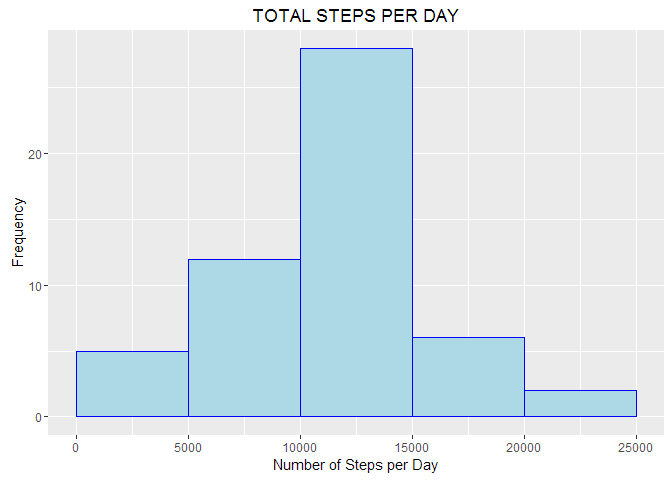
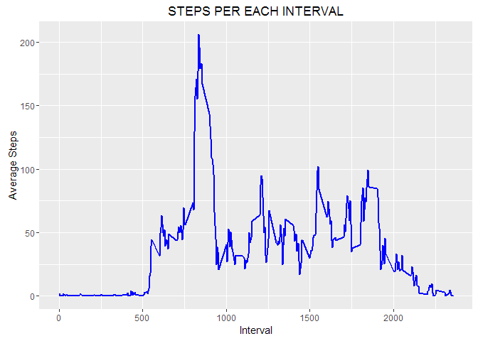
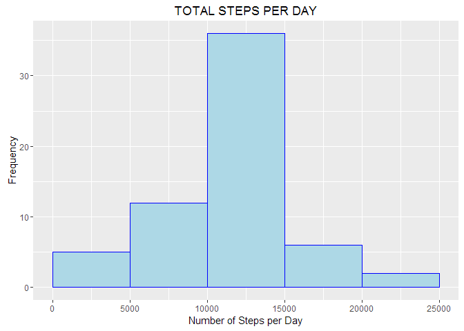
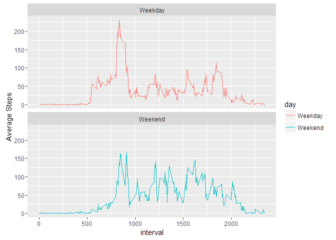

# Reproducible Research: Peer Assessment 1
## Introduction

It is now possible to collect a large amount of data about personal movement using activity monitoring devices such as a Fitbit, Nike Fuelband, or Jawbone Up. These type of devices are part of the "quantified self" movement - a group of enthusiasts who take measurements about themselves regularly to improve their health, to find patterns in their behavior, or because they are tech geeks. But these data remain under-utilized both because the raw data are hard to obtain and there is a lack of statistical methods and software for processing and interpreting the data.

This assignment makes use of data from a personal activity monitoring device. This device collects data at 5 minute intervals through out the day. The data consists of two months of data from an anonymous individual collected during the months of October and November, 2012 and include the number of steps taken in 5 minute intervals each day.

## Loading and preprocessing the data

The original dataset can be found at this url

```r
    url <- "https://d396qusza40orc.cloudfront.net/repdata%2Fdata%2Factivity.zip"
```

We first download the dataset if it's not already in our working directory

```r
    zipFile <- "activity.zip"
    if (!file.exists(zipFile)) {
        download.file(url,zipFile)
    }
```

Before we can load the file we need to first uncompress it

```r
    unzip(zipFile, overwrite = TRUE)
```

We can now load the datafile which is in the csv format

```r
    activityData <- read.csv("activity.csv")
```

The loaded data looks like this

```
## 'data.frame':	17568 obs. of  3 variables:
##  $ steps   : int  NA NA NA NA NA NA NA NA NA NA ...
##  $ date    : Factor w/ 61 levels "2012-10-01","2012-10-02",..: 1 1 1 1 1 1 1 1 1 1 ...
##  $ interval: int  0 5 10 15 20 25 30 35 40 45 ...
```

Note that the dates are read in as factors, so we have to convert them to dates

```r
    activityData$date <- as.Date(activityData$date)
    str(activityData)
```

```
## 'data.frame':	17568 obs. of  3 variables:
##  $ steps   : int  NA NA NA NA NA NA NA NA NA NA ...
##  $ date    : Date, format: "2012-10-01" "2012-10-01" ...
##  $ interval: int  0 5 10 15 20 25 30 35 40 45 ...
```


## What is mean total number of steps taken per day?

Before calculating the mean of the total number of steps per day, we need to sum up the total number of steps per day. There are many ways to do this, lets use the dplyr library


```r
    library(dplyr)
    d <- activityData %>% group_by(date) %>% summarise(dailysteps = sum(steps))
    head(d)
```

```
## # A tibble: 6 x 2
##         date dailysteps
##       <date>      <int>
## 1 2012-10-01         NA
## 2 2012-10-02        126
## 3 2012-10-03      11352
## 4 2012-10-04      12116
## 5 2012-10-05      13294
## 6 2012-10-06      15420
```

We next plot a histogram of the total steps taken daily

```r
    library(ggplot2)
    ggplot(d, aes(dailysteps)) + geom_histogram(fill = "light blue", colour = "blue", 
        breaks = c(0, 5000, 10000, 15000, 20000, 25000)) + 
        labs(y = "Frequency") + 
        labs(x = "Number of Steps per Day") + 
        labs(title = "TOTAL STEPS PER DAY")
```

<!-- -->


```r
    steps.mean <- round(mean(d$dailysteps, na.rm = TRUE),2)
    steps.median <- median(d$dailysteps, na.rm = TRUE)
```

The mean of the total steps taken daily is **10766.19** steps with a median of **10765** steps


## What is the average daily activity pattern?

First we take the average steps taken for each 5-min time interval

```r
    d5 <- activityData %>% group_by(interval) %>% summarise(intSteps = mean(steps, na.rm=TRUE))
    head(d5)
```

```
## # A tibble: 6 x 2
##   interval  intSteps
##      <int>     <dbl>
## 1        0 1.7169811
## 2        5 0.3396226
## 3       10 0.1320755
## 4       15 0.1509434
## 5       20 0.0754717
## 6       25 2.0943396
```

We next plot a time series

```r
    ggplot(d5, aes(interval, intSteps)) + geom_line(lwd = 1, colour = "blue") + 
        labs(y = "Average Steps") + 
        labs(x = "Interval") + 
        labs(title = "STEPS PER EACH INTERVAL")
```

<!-- -->

To compute Which 5-minute interval, on average across all the days in the dataset, contains the maximum number of steps, we first need to find the maximum Average Steps

```r
    max.steps <- max(d5$intSteps)
```

We can then use this to index to the time interval when this happened

```r
    max.int <- d5[d5$intSteps==max.steps,1]
```

The 5-min interval **835** contains the maximum number of steps which is **206.17**. This can also be observed from the graph above

## Imputing missing values

First we need to calculate and report the total number of missing values in the dataset (i.e. the total number of rows with NAs)

```r
    sum.na <- sum(is.na(activityData))
```

The total number of missing values is **2304** values.

To fill in the missing values, we can use the average for that interval
so for each NA, we find what is the interval and then get the average number to fill it with

First we make a copy of dataset, then for every row with an NA, we apply the average steps for that interval


```r
    xc <- activityData
    xc$steps[which(is.na(xc$steps))] <- 
        tapply(xc$steps, xc$interval, mean, na.rm=TRUE, simplify=FALSE )
    ## Need to convert from list to integer as the tapply function returns a list
    xc$steps <- as.vector(xc$steps, mode = "numeric")
```

We then repeat what we have done earlier by with the no NA dataset


```r
    dx <- xc %>% group_by(date) %>% summarise(dailysteps = sum(steps))
    head(dx)
```

```
## # A tibble: 6 x 2
##         date dailysteps
##       <date>      <dbl>
## 1 2012-10-01   10766.19
## 2 2012-10-02     126.00
## 3 2012-10-03   11352.00
## 4 2012-10-04   12116.00
## 5 2012-10-05   13294.00
## 6 2012-10-06   15420.00
```

We next plot a histogram of the total steps taken daily

```r
    ggplot(dx, aes(dailysteps)) + geom_histogram(fill = "light blue", colour = "blue", 
        breaks = c(0, 5000, 10000, 15000, 20000, 25000)) + 
        labs(y = "Frequency") + 
        labs(x = "Number of Steps per Day") + 
        labs(title = "TOTAL STEPS PER DAY")
```

<!-- -->


```r
    steps.meanx <- round(mean(dx$dailysteps, na.rm = TRUE),2)
    steps.medianx <- round(median(dx$dailysteps, na.rm = TRUE),2)
```

The mean of the total steps taken daily is **10766.19** steps with a median of **10766.19** steps

If we were to compare the two cases (with and withous NAs) in a table we get

|   | With NA | Without NA |
| ---| ----- | ------------ |
| Mean Steps | 10766.19 | 10766.19 |
| Median Steps | 10765 | 10766.19 |

As we can see from the above table, the mean has not changed and the median has only changed very slightly

## Are there differences in activity patterns between weekdays and weekends?

First we need to create a new column to indicate a particular day is a weekend of a weekday


```r
    xc <- mutate(xc,day = 
        ifelse(weekdays(xc$date) %in% c("Saturday","Sunday"),"Weekend","Weekday"))
    ## Then need to convert to a factor, mutate creates character variable
    xc$day <- as.factor(xc$day)       
```

Now it's time to create that plot, but before that need to group and summarise

```r
    wd <- xc %>% group_by(interval,day) %>% summarise(intSteps = mean(steps))
```


We next plot a time series

```r
    ggplot(data=wd, aes(x=interval, y=intSteps, group=day)) + geom_line(aes(color=day)) +
    facet_wrap(~day, nrow=2) +
    labs(y="Average Steps")
```

<!-- -->

We can alsi calculate the Mean and Median of the Weekend and Weekday steps

```r
   x <- tapply(wd$intSteps,wd$day,
           function (x) { c(MINIMUM=min(x),MEAN=mean(x),
                        MEDIAN=median(x),MAXIMUM=max(x))})
   x
```

```
## $Weekday
##   MINIMUM      MEAN    MEDIAN   MAXIMUM 
##   0.00000  35.61058  25.80314 230.37820 
## 
## $Weekend
##   MINIMUM      MEAN    MEDIAN   MAXIMUM 
##   0.00000  42.36640  32.33962 166.63915
```


There Weekend Mean and Median are both higher than the weekday mean and median which shows that more steps are being done over the weekend.

As expected, the activities starts later during weekend but are more evenly done compared to the weekdays which shows earlier starts but less activities which could be due to being at work.
